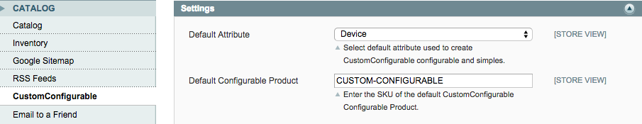

Custom Configurable
===================

Access configurable products over the Magento API. There are endpoints for the Magento REST API
and the frontend.

Description
-----------
Create a configurable product, set its options and associated products. Then access that product
and options over the Magento API. Facilitates creating mobile apps for specific products on your 
Magento website. Lets your user upload photos using the API and add the product to the cart and
checkout.

Installation
------------
Upload all the files to the root of your Magento site. Let the setup scripts run.

1. Create the attribute that you will be using for the configurable product. 
Make sure that 'Values Required' is Yes, that the 'Catalog Input Type for Store Owner' is 
Dropdown and 'Use To Create Configurable Product' is set to Yes. 
2. Add the attribute to the CustomConfigurable attribute set.
3. Create the configurable product, selecting CustomConfigurable as the attribute set.  
Create the simples for your attribute options.
4. In the admin, under System -> Configuration -> Catalog -> CustomConfigurable, 
set the attribute and sku of the configurable product in the configuration.

    
5. Add custom options to your configurable product.
    
6. In the admin, under System -> Web Services -> REST - Roles and REST - Attributes, 
allow all guest roles and attributes.

Options
-------

Description: Get CustomConfigurable configurable options. 

Frontend GET: http://www.example.com/customconfigurable/index/option/

API GET: http://www.example.com/api/rest/customconfigurable/option/

To get images for options that have been overridden in the configurable simple, specify the
configurable product SKU and option value id in the url. For example, [CUSTOM-CONFIGURABLE] 
is the SKU and the option value id is [58]: 

<pre>
http://www.example.com/customconfigurable/index/option/product/[CUSTOM-CONFIGURABLE]/id/[58]
</pre>

Photo
-----

Description: Upload an image that can be later added to the cart.

Frontend POST: http://www.example.com/customconfigurable/index/photo/

API POST: http://www.example.com/api/rest/customconfigurable/photo/

JSON (code is the lowercased name of the photo option, image data is Base-64 encoded):
<pre>
{
    "filename" : "test.jpg",
    "code" : "photo",
    "data" : "/9j/4QAYRXhpZgAASUkqAAgAAAAAAAAAAAAAAP/sABFEdWNreQABAAQAAAAeA..." 
}
</pre>

FRONTEND SUCCESS:
<pre>
{
    "Location" : "http://www.example.com/media/aydus/customconfigurable/t/e/1422310173-test.jpg"
}
</pre>

API SUCCESS:
There will be a url to the uploaded image in the Location header.

Quote - Add to Cart
-------------------

Description: Submit selected options and photo and add product to the cart. Photo is the url received in the 
previous endpoint.

Frontend POST: http://www.example.com/customconfigurable/index/quote

API POST: http://www.example.com/api/rest/customconfigurable/quote

JSON:
<pre>
{
    "device" : "58",
    "case" : "30",
    "photo" : "http://www.example.com/media/aydus/customconfigurable/j/a/1422310173-test.jpg"
}
</pre>

FRONTEND SUCCESS:
<pre>
{
    "Location" : "http://www.example.com/customconfigurable/index/quote/hash/7dd8f42d38c138d9c9e3927d22c76ce4"
}
</pre>

API SUCCESS:
There will be a url and hash in the Location header for you to obtain the quote id.

Quote ID
--------------------

After you add to cart, you can get the quote id so you can place the order. The [HASH] parameter is the 
MD5 hash from the url you received after adding to cart.

Frontend GET: http://www.example.com/customconfigurable/index/quote/hash/[HASH]

API GET: http://www.example.com/api/rest/customconfigurable/quote/[HASH]

RESPONSE:

<pre>
{  
    "hash" : "7dd8f42d38c138d9c9e3927d22c76ce4", 
    "quote" : "3745866"  
}
</pre>

Place Order
-----------

To place the order, you will need the Quote ID you obtained after adding to the cart.

Frontend POST: http://www.example.com/customconfigurable/index/order

API POST: http://www.example.com/api/rest/customconfigurable/order

JSON:
<pre>
{
  "quote": "3745866",
  "email" : "jdoe@test.com",
  "billing": {
    "firstname": "John",
    "lastname": "Doe",
    "street": [
      "123 Main Street"
    ],
    "city": "Springfield",
    "region": "New Jersey",
    "postcode": "07081",
    "country": "US",
    "telephone" : "856-555-1122"
  },
  "shipping": {
    "firstname": "John",
    "lastname": "Doe",
    "street": [
      "123 Main Street"
    ],
    "city": "Springfield",
    "region": "New Jersey",
    "postcode": "07081",
    "country": "US",
    "telephone" : "856-555-1122"
  },
  "shipping_method": "flatrate_flatrate",
  "payment_method": {
    "method": "ccsave",
    "cc_type": "VI",
    "cc_owner": "John Doe",
    "cc_number": "4111111111111111",
    "cc_exp_month": "04",
    "cc_exp_year": "2017",
    "cc_cid": "122"
  }
}
</pre>

FRONTEND SUCCESS:
<pre>
{
    "Location" : "http://www.example.com/customconfigurable/index/order/increment_id/1500029111"  
}
</pre>

API SUCCESS:
There will be a url and order increment id in the Location header for you to obtain the order status.

Order Status
------------

Get the order status.

Frontend GET: http://www.example.com/customconfigurable/index/order/id/1500029111

API GET: http://www.example.com/api/rest/customconfigurable/order/1500029111

RESPONSE:

<pre>
{
    "status" : "pending"
}
</pre>
